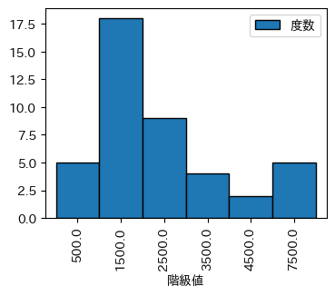
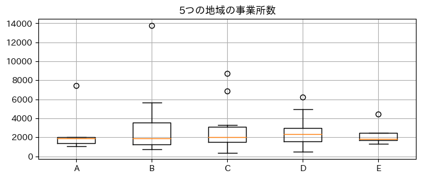
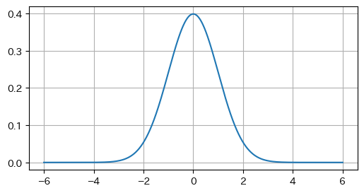

# dataAnalyticsBasic データアナリティクスの基礎

[TOC]

## データサイエンスの基本
### データの構造化とデータマネジメント

#### データアナリティクスと問題解決
##### データアナリティクス
- データサイエンスに必要なスキル
    - データサイエンス(PC・AI・統計学)
    - データエンジニアリング力(意味ある形に実装・運用)
    - ビジネス力(課題を整理し解決)
##### 分析の目的
- 問題解決のための手がガリ
- 客観的な事実に基づいた科学的な意思決定
##### 情報倫理
- 機密処理
- 不正利用

#### 構造化データと非構造化データ
##### 量的変数と質的変数
- 量的変数: 数値的な量
- 質的変数: 分類を表す形
##### 構造化データと非構造化データ
- 構造化データ: テーブルデータ
- 非構造化データ: テキストデータや画像データ
##### ロングフォーマットとワイドフォーマット
- ロングフォーマット: 縦長のデータ
- ワイドフォーマット: 横長のデータ
##### 欠損値の対処
- リストワイズ(ケースワイズ)除去: 欠損値を含む行(列)を削除
- 代入法: 平均値や中央値などで代入する
    - 多重代入法
    - 期待値代入法
##### 層別パレート分析

## 質的データのアナリティクス
### 重点志向とパレート分析
#### パレート分析の手順とパレート表
##### パレート表
- 頻度とコストで評価
##### パレート図
- コストを棒グラフで、頻度を折れ線グラフで表したもの
#### 層別パレート分析
- クロス集計表の作成
- 特化係数
    - 特化係数が1であれば、部分集団の割合が全体集団と同じ
    - 1より離れた値をとると、交互作用効果があることを意味する 
$$ 特化係数 = \frac{部分集団の割合}{全体集団の割合} $$

### データ項目間の関連性とクロス集計分析
#### クロス集計表
##### 周辺分布に関する問題
- 「商品への関心」に関する周辺分布
- 「スポーツ中継」に関する周辺分布

| sports\interest | ある  | ない  | 周辺分布 |
| :-------------: | :---: | :---: | :------: |
|     みない      |  131  |  53   |   184    |
|      みる       |  68   |  188  |   256    |
|    周辺分布     |  199  |  241  |   440    |

##### 同時分布に関する問題

- 二つの質的データの同時分布

| sports\interest | ある  | ない  |
| :-------------: | :---: | :---: |
|     みない      |  131  |  53   |
|      みる       |  68   |  188  |

- 総計に対する割合

| sports\interest | ある  | ない  | 周辺分布 |
| :-------------: | :---: | :---: | :------: |
|     みない      | 29.8% | 12.0% |  41.8%   |
|      みる       | 15.5% | 42.7% |  58.2%   |
|    周辺分布     | 45.2% | 54.8% |  100.0%  |

##### 条件付分布に関する問題

- 商品の関心の条件付分布

| sports\interest | ある  | ない  | 周辺分布 |
| :-------------: | :---: | :---: | :------: |
|      みる       | 26.6% | 73.4% |  100.0%  |
|     みない      | 71.2% | 28.8% |  100.0%  |
|      Total      | 45.2% | 54.8% |  100.0%  |

- スポーツ中継の条件付分布

| sports\interest |  ある  |  ない  | 周辺分布 |
| :-------------: | :----: | :----: | :------: |
|      みる       | 34.2%  | 78.0%  |  58.2%   |
|     みない      | 65.8%  | 22.0%  |  41.8%   |
|      Total      | 100.0% | 100.0% |  100.0%  |

- 条件付(構成)割合に明らかな違いが**ある**とき、二つの質的変数の間には**関連がある**
- 条件付(構成)割合に明らかな違いが**ない**とき、二つの質的変数の間には**関連がない**

#### 連関係数と $\chi^2$ 検定 ~関連性の強さを見る~

##### 観測度数と期待度数

##### 二つの変数に関連がないことを仮定したときの期待度数

##### $\chi^2$ 統計量: 観測度数の期待度数からの乖離

$$
\frac{(観測度数-期待度数)^2}{期待度数}
$$

##### クラメールとピアソンの連関係数

- クラメールの連関係数
$$ r_c = \sqrt{\frac{\chi^2}{n_{\cdot\cdot}(k-1)}} \ , \quad n_{\cdot\cdot} = sum(data), \ k = min(a, \ b) $$
- ピアソンの連関係数
$$ r_p = \sqrt{\frac{\chi^2}{\chi^2 + n}} $$

##### $\chi^2$ 検定: 母集団における関連性の検定
- 帰無仮説 $H_0$ と対立仮設 $H_1$ 
- 有意水準 $\alpha$ の決定
- $chi^2$ 統計量の計算
- 自由度 $(a-1)(b-1)$ $chi^2$ 分布を確認
- 有意水準 $\alpha$ の時の $chi^2$ の値と計算した $chi^2$ 統計量を比較
- 計算した $chi^2$ 統計量 のほうが大きければ有意でない → 関連性があるといえる

## 量的データのアナリティクス
### 分布構造の把握と基本統計量
#### 分布の把握
##### 度数分布表

|                   | 階級値 | 度数  | 相対度数 | 累積度数 | 相対累積度数 |
| :---------------: | :----: | :---: | :------: | :------: | :----------: |
| (-0.001, 1000.0]  | 500.0  |   5   | 0.116279 |    5     |   0.116279   |
| (1000.0, 2000.0]  | 1500.0 |  18   | 0.418605 |    23    |   0.534884   |
| (2000.0, 3000.0]  | 2500.0 |   9   | 0.209302 |    32    |   0.744186   |
| (3000.0, 4000.0]  | 3500.0 |   4   | 0.093023 |    36    |   0.837209   |
| (4000.0, 5000.0]  | 4500.0 |   2   | 0.046512 |    38    |   0.883721   |
| (5000.0, 10000.0] | 7500.0 |   5   | 0.116279 |    43    |   1.000000   |

##### ヒストグラム

- 右裾、左裾
- 単峰性、多峰性

#### 基本統計量

##### 平均値

$$ \bar{x} = \sum_{i=1}^n x_i $$

##### 中央値

$$ median(odd) = x_{n/2} $$
$$ median(even) = \frac{x_{n/2-0.5}+x_{n/2+0.5}}{2}  $$

- データを小さいほうから並べて中央になる値
- 偶数個の場合は、二つの値の平均をとる

##### 最頻値

- 出現回数が一番多いデータ
- ヒストグラムでは一番多い階級の階級値で示す

###### 平均値、中央値、最頻値の特徴

- 左右対称の分布: 近い値になる
- 右裾の分布: 最頻値 < 中央値 < 平均値
- 左裾の分布: 最頻値 > 中央値 > 平均値

##### パーセント点

- データを小さい値から並べたとき、100 $\alpha$ %点に位置する値
- 第一四分位数: 25%点
- 中央値: 50%点
- 第三四分位数: 75%点
- 小さいほうから数えたとき: 下側パーセント点
- 大きいほうから数えたとき: 上側パーセント点

##### 分散と標準偏差

- 母集団について

$$ s^2 = \frac{1}{n} \sum_{i=1}^n (x_i - \bar{x})^2 \ , \ s = \sqrt{s^2} $$

$$ s^2 = E[x^2] - (E[x])^2 $$

##### 不偏分散と標本標準偏差

- 標本について

$$ \sigma^2 = \frac{1}{n-1} \sum_{i=1}^n (x_i - \bar{x})^2 \ , \ \sigma = \sqrt{\sigma^2} $$

##### 四分位範囲、範囲

- 四分位範囲 = 第三四分位 - 第一四分位
- 四分位偏差 = 四分位範囲 / 2
- 範囲 = 最大値 - 最小値

- 様々な統計量

| area  |  25%   |  50%   |  75%   | count |   max   |  mean  |  min   |  std   |
| :---: | :----: | :----: | :----: | :---: | :-----: | :----: | :----: | :----: |
|   A   | 1407.5 | 1883.5 | 2023.5 |  6.0  | 7453.0  | 2604.8 | 1090.0 | 2405.4 |
|   B   | 1274.0 | 1884.0 | 3584.0 |  9.0  | 13790.0 | 3473.0 | 729.0  | 4169.2 |
|   C   | 1500.7 | 2012.5 | 3115.0 | 14.0  | 8718.0  | 2676.0 | 379.0  | 2389.4 |
|   D   | 1607.0 | 2325.5 | 2983.2 | 10.0  | 6265.0  | 2674.6 | 471.0  | 1757.7 |
|   E   | 1686.0 | 1805.0 | 2458.0 |  5.0  | 4462.0  | 2347.6 | 1327.0 | 1250.6 |

#### グラフと統計量

##### 箱ひげ図

- 最小値・第一四分位数・中央値・第三四分位数・最大値で示したもの
- 分布の特徴を比較することができる

##### シグマの法則

- 正規分布において

- $\mu \pm 1 \sigma$ の区間にデータの $68.268$ %(2/3)が含まれる
    - 100万回に690,000回発生
- $\mu \pm 2 \sigma$ の区間にデータの $95.449$ %(ほとんど)が含まれる
    - 100万回に308,537回発生
- $\mu \pm 3 \sigma$ の区間にデータの $99.730$ %(ほぼすべて)が含まれる
    - 100万回に66,807回発生
- $\mu \pm 4 \sigma$ の区間にデータの $99.993$ %(ほぼすべて)が含まれる
    - 100万回に6,211回発生
- $\mu \pm 5 \sigma$ の区間にデータの $99.99994$ %(ほぼすべて)が含まれる
    - 100万回に233回発生
- $\mu \pm 6 \sigma$ の区間にデータの $99.9999998$ %(ほぼすべて)が含まれる
    - 100万回に3.4回発生

##### 管理図

- 平均と範囲を用いる $\bar{x}-R$ 管理図
- 平均と標準偏差を用いる $\bar{x}-s$ 管理図

#### 変動係数と偏差値
##### 変動係数
- 標準偏差を平均で比をとることで相対的な評価を行う

$$ CV = \frac{s}{\bar{x}} $$

##### 標準得点と偏差値
- 標準得点
$$ x_1 = \frac{x_i - \bar{x}}{s} $$
- 偏差値
$$ x_2 = x_1 \times 10 + 50 $$

- 偏差値の計算

|  得点  |  偏差  | 標準得点 | 偏差値 |
| :----: | :----: | :------: | :----: |
| 100.00 | 14.00  |   1.17   | 61.67  |
| 70.00  | -16.00 |  -1.33   | 36.67  |
| 80.00  | -6.00  |  -0.50   | 45.00  |
| 80.00  | -6.00  |  -0.50   | 45.00  |
| 100.00 | 14.00  |   1.17   | 61.67  |

### 相関・予測と回帰分析

#### 相関分析
##### 散布図
- 1組の量的変数のばらつきを可視化するグラフ
- 正の相関、負の相関、無相関などを目視で確認できる
##### 相関係数と共分散
$$ r = \frac{s_{xy}}{s_x s_y} \ ,\ s_{xy} = \frac{1}{x_i}(x-\bar{x})(y_i-\bar{y}) $$

- 相関行列(n=175)

|           |    pop    |   area    |    age    | household |  ratio   |
| :-------: | :-------: | :-------: | :-------: | :-------: | :------: |
|    pop    | 1.000000  |     -     |     -     |     -     |    -     |
|   area    | -0.053318 | 1.000000  |     -     |     -     |    -     |
|    age    | -0.448625 | 0.278114  | 1.000000  |     -     |    -     |
| household | 0.996342  | -0.070386 | -0.450620 | 1.000000  |    -     |
|   ratio   | 0.511483  | -0.320585 | -0.434113 | 0.524136  | 1.000000 |

##### 相関係数の解釈
- 相関分析
- 相関係数 $r$ による正負相関の強さのイメージ

|    r<-0.7    | -0.7<r<-0.4 | -0.4<r<-0.2 | -0.2<r<0.2 | 0.2<r<0.4 | 0.4<r<0.7 |    0.7<r     |
| :----------: | :---------: | :---------: | :--------: | :-------: | :-------: | :----------: |
| 強い負の相関 |  やや強い   |    弱い     |   無相関   |   弱い    | やや強い  | 強い正の相関 |

#### 回帰分析
##### 回帰直線
- 説明変数 $x$ から目的変数 $y$ の値を推定する
- $\alpha, \beta$ を回帰係数といい1次式の直線で表すことを回帰分析という
$$ y = \alpha + \beta x $$

##### 回帰直線の解釈
- $\alpha$: 切片
- $\beta$: 直線の傾き

##### 回帰直線の信頼の程度
- 残差: 観測値と予測値の差
- 決定係数($R^2$値、寄与率)
    - 目的変数を100%としたときに説明変数でどのくらい説明できているかをしめす
    - 単回帰分析の場合は相関係数の2乗になる

##### 重回帰分析
- 説明変数が複数ある場合
- $\alpha, \beta_2, \cdots$ を偏回帰係数という

$$ y = \alpha + \beta_1 x_1 + \beta_2 x_2 + \cdots $$

- 自由度調整済決定係数

$$
R_f^2 = 1 - \frac{\sum(y_i-\hat{y}_i)^2 / (n-k-1)}{\sum(y_i-\bar{y})^2 / (n-1)} \ , \ k=説明変数の数
$$

## 確率・確率分布・推測のアナリティクス
### 確率に基づく判断
#### 二項分布を用いた分析

$$ P(X=x) = {}_nC_x p^x q^{n-x} $$
$$
B(n, \ p) \rightarrow E(X) = np \ , \ V(X) = npq
$$

#### 正規分布を用いた分析
- 確率密度関数
$$ P(a \leq X \leq b) = \int_a^b f(x) dx $$ 
- 正規分布
$$
f(x) = \frac{1}{\sqrt{2\pi}\sigma} \exp \Big(-\frac{(x-\mu)^2}{2\sigma^2} \Big)
\ , \ (-\infty \lt x \lt \infty)
$$
- 標準正規分布
$$
f(x) = \frac{1}{\sqrt{2\pi}} \exp \Big(-\frac{x^2}{2} \Big)
\ , \ (-\infty \lt x \lt \infty)
$$
- 正規分布の再生性
$$
X_1 \sim N(\mu_1, \sigma_1^2), \ X_2 \sim N(\mu_2, \sigma_2^2), 独立ならば
$$
$$
aX_1 + bX_2 \sim N(a\mu_1+ b\mu_2, \ a^2\sigma_1^2 + b^2\sigma_2^2)
$$

#### いろいろな確率分布を用いた分析
##### $\chi^ 2$ 分布
$$ X = \sum_{i=1}^n Z_i^2 \sim \chi^2(n) $$
##### t分布
$$ t = \frac{Z}{\sqrt{X/n}} \sim t(n) $$

#### クロス集計表と条件付確率/ベイズの定理を用いた分析
##### クロス集計表と条件付確率
- 感染症の検査で実際に感染している確率

|       |    罹患有り    |    罹患無し    |    合計    |
| :---: | :------------: | :------------: | :--------: |
| 陽性  |     真陽性     |     偽陽性     | 陽性の確率 |
| 陰性  |     偽陰性     |     真陰性     | 陰性の確率 |
| 合計  | 罹患ありの確率 | 罹患なしの確率 |   全確率   |

|           |           $A$           |           $\bar{A}$           | 合計  |
| :-------: | :---------------------: | :---------------------------: | :---: |
|    $B$    |    $P(A\cap B)=0.36$    |    $P(\bar{A}\cap B)=0.04$    | $0.4$ |
| $\bar{B}$ | $P(\bar{A}\cap B)=0.12$ | $P(\bar{A}\cap \bar{B})=0.48$ | $0.6$ |
|   合計    |       $P(A)=0.48$       |          $P(A)=0.52$          | $1.0$ |

$$
感度= \frac{真陽性}{真陽性+偽陰性} \ , \ 特異度=\frac{真陰性}{偽陽性+真陰性}
$$

- Aが起きた条件の下でのBの起こる確率
$$
P(A|B) = \frac{P(A\cap B)}{P(B)}
$$
##### ベイズの定理
$$
P(A\cap B) = P(A|B){P(B)} = P(B|A){P(A)}
$$
$$
P(B|A) = \frac{P(A|B)P(B)}{P(A)}
$$

### 統計的な推測
#### 推定に伴う誤差
##### 母集団と標本
##### 点推定・区間推定、標準誤差
- 点推定: 一つの値で推定
- 区間推定: 区間で推定
- 標準誤差: 標本分布の標準偏差
#### 区間推定
##### 母平均の区間推定
- 母分散が既知
$$ Z = \frac{x - \mu}{\sigma/\sqrt{n}} \ , \quad 
\mu = \hat{\mu} \pm  Z_{\alpha/2} \frac{\sigma}{\sqrt{n}}
$$ 
- 母分散が既知
- 母分散が未知
$$ t = \frac{x - \mu}{\hat{\sigma}/\sqrt{n}} \ , \quad
\mu = \hat{\mu} \pm  t_{\alpha/2}(n-1) \frac{\hat{\sigma}}{\sqrt{n}} $$
##### 母比率の区間推定
$$ 
Z = \frac{\hat{p} - p}{\sqrt{p(1-p)/n}} \ , \quad
p =  \pm Z_{\alpha/2} \sqrt{\frac{\hat{p}(1-\hat{p})}{n}}
$$ 

#### 仮説検定とその考え方

##### 仮説検定とそのロジック
- 母集団に関する仮説の真偽を判断する方法
- 帰無仮説: 否定されることが前提の仮説
- 対立仮説: 帰無仮説が棄却されたときに採択される仮説
##### 両側検定と片側検定
- 両側検定
- 片側検定
##### 仮説検定の手順
- 帰無仮説 $H_0$ と対立仮設 $H_1$ を設定
- 帰無仮説の下で、検定統計量の確率分布を確認
- 有意水準 $\alpha$ の設定
- 標本データから検定統計量の実現値を計算
- $p$ 値と有意水準 $\alpha$ を比較
- 仮説を判断
#### 仮説検定の方法
##### 1母集団の平均値に関する検定
- 母分散が既知
- 母分散が未知

##### 2母集団の平均値に関する検定
- 母分散がいずれも既知
- 母分散がいずれも未知
    - 等分散: プール分散
    - 等分散でない: Welchの検定
    - 対応のあるデータ: データの差による検定

## 時系列・テキスト・乱数データのアナリティクス
### 時系列データの分析
#### 指数・増減率・成長率
##### 指数
$$ t時点での指数 = \frac{t時点の値}{基準時点の値} \times 100 $$
##### 増減率
$$ t時点での増加率 = \frac{t時点の値 - 基準時点の値}{基準時点の値} \times 100 $$
##### 成長率
$$ t時点での成長率 = \frac{t時点の値 - t-1時点の値}{t-1時点の値} $$

#### 移動平均・季節調整・寄与度分解
##### 時系列データの4つの変動成分
- 傾向変動: 上昇や下降などの単調な動き
- 循環変動: 周期が定まっていない循環的な動き
- 季節変動: 一年を周期とした動き
- 不規則変動: 上記以外の突発的な動き

##### 移動平均
- 中央移動平均
- 後方移動平均
- 前方移動平均
##### 季節変動と中心化移動平均
- 移動平均で季節変動を消すことができる
- 違反木中心形移動平均など
##### 季節指数と季節調整値の求め方
- 季節指数: ひと月当りの平均を100とし各月の季節成分の大きさを示す
$$ t月の季節調整値 = \frac{t月の原系列(元の値)}{t月の季節指数} \times 100 $$
$$ t四半期の季節調整値 = \frac{t四半期の原系列(元の値)}{t四半期の季節指数} \times 100 $$
##### 季節変動がある場合の成長率: 対前年同月比(対前年同期比)
- 傾向が季節によるものか、成長によるものかをみる
- 前年度の同じ時期と比較することでトレンドのみを見ることができる
##### 成長率の寄与度分解
- 寄与度
    - それぞれの成分が全体の成長率にどの程度、影響しているのかを分解した指標
    - 全体の成長率をポイントとして分解 → 各寄与度の合計は成長率と等しい

$$
部分系列Aの寄与度 = \frac{t 時点での部分系列 A の値 - t-1 時点での部分系列 A の値}{t-1 時点での合計系列 T の値}
$$
$$
部分系列Aの寄与度 = t 時点での部分系列 A の成長率 - t-1 時点での部分系列 A の構成割合
$$

### テキストデータの分析
#### 文書データの処理
##### 文書データと自然言語処理
- 文書の電子化
- クリーニング
- 文書の解析
- データの集計
- データの分析

##### 形態素解析
- 形態素解析に現れる瀕死の例

| 品詞   | 分類   | 意味 | 例   |
| :----- | :----- | :--- | :--- |
| 名詞   | 自立語 |      |      |
| 動詞   | 自立語 |      |      |
| 形容詞 | 自立語 |      |      |
| 副詞   | 自立語 |      |      |
| 助動詞 | 付属語 |      |      |
| 助詞   | 付属語 |      |      |

#### 文書データの統計処理
##### データの集計と頻度分析
##### n-gram
##### 共起
- ある語句と語句が同時に出現しやすい状況
### シミュレーションと乱数
#### シミュレーション
##### 乱数によるシミュレーション
- 乱数: 0.0以上・1.0未満などの範囲で一様分布により発生させる
- モンテカルロ法: 円の面積を乱数により近似的に求める事が可能
##### 乱数の発生
- 逆関数により一様乱数から特定の分布を発生させる
- 正規分布
- ベータ分布
- ガンマ分布
- $\chi^2$ 分布
- $t$ 分布
- $F$ 分布
##### シミュレーションに用いられる関数
- ベルヌーイ分布
- 二項分布
- 正規分布
- ポアソン分布
- 一様分布

| 分布           | 期待値         | 分散              | np.random         |
| :------------- | :------------- | :---------------- | :---------------- |
| ベルヌーイ分布 | $E(X)=p$       | $V(X)=pq$         |                   |
| 二項分布       | $E(X)=np$      | $V(X)=npq$        | binomial()        |
| 正規分布       | $E(X)=\mu$     | $V(X)=\sigma^2$   | normal()          |
| ポアソン分布   | $E(X)=\lambda$ | $V(X)=\lambda$    | poisson()         |
| 一様分布       | $E(X)=(a+b)/2$ | $V(X)=(b-a)^2/12$ | rand(), randint() |

#### 代表的なシミュレーション
##### コイン投げのシミュレーション

$$
p(X) = {}_nC_x p^x (1-p)^{n-x}
$$

##### 大数の法則のシミュレーション

## 実践模擬問題
### 模擬問題と解答